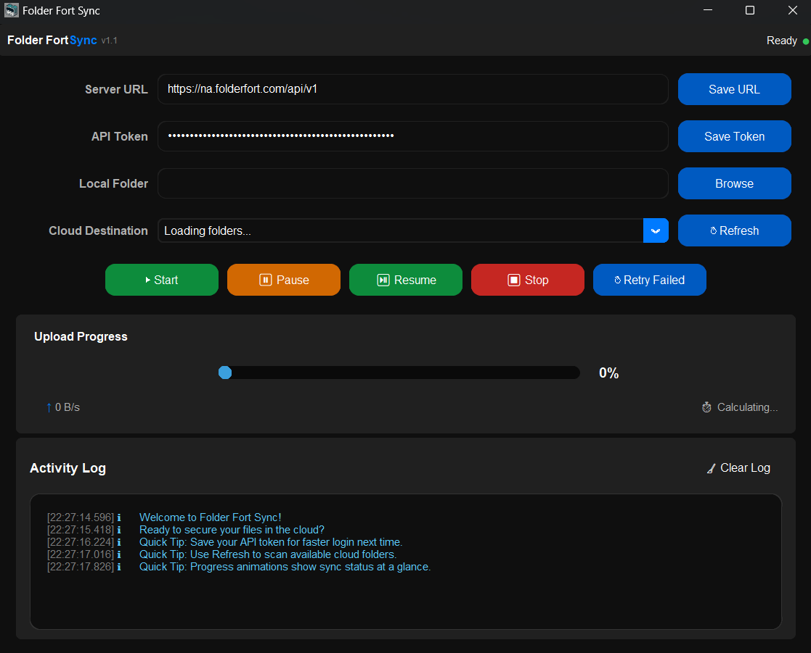

# Folder Fort Sync



A simple and feature rich tool to sync your files and folders securely from your PC to **FolderFort Cloud**. Built with **Python** and **CustomTkinter**, it provides minimal dark themed interface to manage and sync files effortlessly.

## 🚀 Features
- **Save API Token** 🔑 – Save and reuse API credentials.
- **Browse Local Folder** 📂 – Easily select the folder to sync.
- **Choose Cloud Destination** ☁️ – Pick where your files should be stored.
- **Start, Pause, Resume, Stop** ⏯️ – Full control over your sync process.
- **Retry Failed Uploads** 🔄 – Automatically retry failed transfers.
- **Real-time Logs & Progress Bar** 📊 – Keep track of upload status.
- **Dark Mode UI** 🌙 – Sleek, modern, and easy on the eyes.

## 🛠️ Installation

### 1️⃣ Install Dependencies
Make sure you have **Python 3.9+** installed. Then, install the required packages:

```sh
pip install customtkinter requests humanize keyring
```

### 2️⃣ Download the latest release
Download the latest code in a zip file from:
# Releases Tag (1.0)
# Code Button (As a Zip File)

**🔴[YOU CAN ALSO CLONE THE REPOSITORY]**


### 3️⃣ Run the App
Open the Folder and right click to open in terminal then paste the following command:
```sh
python sync_app.py
```
**🔴[YOU CAN ALSO RUN THE SYNC_APP.PY FILE WITH A CODE EDITOR LIKE VS-CODE/PYCHARM]**

## 🏗️ Project Structure
```
📁 folder-fort-sync/
├── sync_app.py            # Main application file (RUN THIS)
├── file_uploader.py       # Handles file uploads
├── folder_manager.py      # Manages folder operations
├── ui_components.py       # UI elements
├── icon.ico               # Icon file of the app
└── README.md              # This file
```

## 📝 Usage
1. **Enter your API Token** and save it for quick access. [It will be stored locally in an encrypted way]
2. **Select a local folder** containing the files/folders you want to upload.
3. **Choose a cloud destination** using the dropdown menu to select your destination folder.
4. **Click Start** to begin the sync process.
5. Use **Pause, Resume, or Stop** as needed.
6. If some files fail, click **Retry Failed** to attempt re-upload.

## 🔧 Dependencies Used
```python
import customtkinter as ctk
from tkinter import filedialog, messagebox
import threading
import os
from typing import Dict, List
from pathlib import Path
import time
import requests
import humanize
import keyring
import json
from queue import Queue
```

## 💡 Contributing
Pull requests are welcome! Open an issue if you find a bug or have a feature request.

## 📜 License
MIT License. Feel free to use and modify!
